## Confirmed Tech Stack & Decoupled Multi-Repo Strategy

> [!IMPORTANT]
> **Decoupled Architecture (Separate Repositories):**
> This project is **NOT a monolith**. The Frontend and Backend live in completely separate GitHub repositories and communicate strictly over REST APIs via JSON.
> * **Frontend Repo (`toy-store-frontend`):** Pure React (Vite/React) deployed on Vercel.
> * **Backend Repo (`toy-store-backend` / `toy-store-api`):** Pure Node.js + Express API + Supabase PostgreSQL deployed on Vercel Serverless / Render.

---

### Pure Backend Repository Blueprint (`toy-store-backend`)

```text
toy-store-backend/
├── .github/workflows/     # CI/CD (linting, automated tests)
├── api/                   # Vercel serverless entrypoint
│   └── index.js           # Exports Express app for Vercel
├── database/              # Supabase SQL Migrations & RLS Scripts
│   ├── schema.sql         # 14 Tables, Indexes, Constraints (DDL)
│   ├── seed.sql           # Initial categories & sample toys
│   └── rls_policies.sql   # Supabase Row Level Security rules
├── src/
│   ├── config/            # Supabase client, env variables
│   │   ├── env.js
│   │   └── supabase.js
│   ├── routes/            # 1. 📍 The Map: URL routing (/api/v1/...)
│   │   ├── auth.routes.js
│   │   ├── product.routes.js
│   │   ├── category.routes.js
│   │   ├── cart.routes.js
│   │   ├── order.routes.js
│   │   ├── payment.routes.js
│   │   ├── shipment.routes.js
│   │   ├── review.routes.js
│   │   ├── admin.routes.js
│   │   └── index.js
│   ├── middleware/        # 2. 👮 The Security Guards
│   │   ├── verifyJwt.js        # JWT authentication checkpoint
│   │   ├── roleCheck.js        # RBAC (Admin vs Customer)
│   │   ├── rateLimiter.js      # Protects API & Supabase quota
│   │   ├── validateReq.js      # Request body schema validator
│   │   └── error.middleware.js # Centralized 500/400 error handler
│   ├── controllers/       # 3. 🚦 The Traffic Cop (Thin req/res)
│   │   ├── auth.controller.js
│   │   ├── product.controller.js
│   │   ├── category.controller.js
│   │   ├── cart.controller.js
│   │   ├── order.controller.js
│   │   ├── payment.controller.js
│   │   ├── shipment.controller.js
│   │   └── admin.controller.js
│   ├── services/          # 4. 🧠 The Brain (Business Logic, calculations, totals)
│   │   ├── auth.service.js
│   │   ├── product.service.js
│   │   ├── cart.service.js
│   │   ├── order.service.js
│   │   ├── payment.service.js
│   │   └── shipment.service.js
│   ├── repositories/      # 5. 🗄️ The Pantry Manager (Supabase queries ONLY)
│   │   ├── user.repository.js
│   │   ├── profile.repository.js
│   │   ├── address.repository.js
│   │   ├── category.repository.js
│   │   ├── product.repository.js
│   │   ├── inventory.repository.js
│   │   ├── cart.repository.js
│   │   ├── order.repository.js
│   │   ├── payment.repository.js
│   │   ├── shipment.repository.js
│   │   └── review.repository.js
│   ├── utils/             # Helpers, formatters, standard responses
│   │   ├── apiResponse.js      # { success: true, data, meta }
│   │   ├── apiError.js         # Custom AppError class
│   │   └── constants.js        # Status enums, default limits
│   └── app.js             # Express app setup, CORS, JSON parsers
├── .env.example           # Template for environment variables
├── .gitignore             # node_modules, .env, logs
├── package.json           # Scripts & dependencies
├── vercel.json            # Serverless routing config for Vercel
└── README.md              # API documentation & local setup instructions
```

## Category Architecture Decision: Flat Categories vs Hierarchical Categories

> [!NOTE]
> **Why `parentId` originally existed (Self-Referential Foreign Key):**
> In relational databases, a table can reference itself (`parentId` pointing back to `categoryId` in the same `CATEGORIES` table) to create nested subcategories (e.g. *Toys* $\rightarrow$ *Building Blocks* $\rightarrow$ *LEGO*) without needing a separate `parent_categories` table.
>
> **Design Simplification for this Project:**
> To keep the toy store simple, maintainable, and avoid nested query overhead, we have **removed `parentId`**. Categories are now **flat single-level tags** (e.g., *“Action Figures”*, *“Board Games”*, *“Building Sets”*, *“Plush Toys”*, *“Outdoor & Sports”*).

---


In a physical toy store, the core lifecycle revolves around **Inventory & Stock management**, **Shopping Carts**, **Checkout & Shipping Addresses**, **Financial Transactions (Orders & Payments)**, and **Order Fulfillment (Shipments & Tracking)**.

### Entity Relationship Model (ERD)

```mermaid
erDiagram
    USERS ||--|| PROFILES : "has"
    USERS ||--o{ ADDRESSES : "saves"
    USERS ||--o{ ORDERS : "places"
    USERS ||--o{ CARTS : "has"
    USERS ||--o{ REVIEWS : "writes"

    CATEGORIES ||--o{ PRODUCTS : "contains"
    
    PRODUCTS ||--|| INVENTORIES : "tracks stock"
    PRODUCTS ||--o{ PRODUCT_IMAGES : "has"
    PRODUCTS ||--o{ CART_ITEMS : "added in"
    PRODUCTS ||--o{ ORDER_ITEMS : "sold in"
    PRODUCTS ||--o{ REVIEWS : "receives"

    CARTS ||--o{ CART_ITEMS : "contains"

    ORDERS ||--|{ ORDER_ITEMS : "consists of"
    ORDERS ||--o{ PAYMENTS : "paid via"
    ORDERS ||--o{ SHIPMENTS : "fulfilled by"
    ORDERS }o--|| ADDRESSES : "shipped to"

    USERS {
        uuid userId PK
        string email UK
        string passwordHash
        enum role "CUSTOMER | ADMIN"
        enum status "ACTIVE | SUSPENDED"
        timestamp createdAt
        timestamp updatedAt
    }

    PROFILES {
        uuid userId PK,FK
        string firstName
        string lastName
        string phone
        string avatarUrl
        timestamp createdAt
        timestamp updatedAt
    }

    ADDRESSES {
        uuid addressId PK
        uuid userId FK
        string recipientName
        string phone
        string addressLine1
        string addressLine2
        string city
        string stateProvince
        string postalCode
        string country
        boolean isDefaultShipping
        timestamp createdAt
        timestamp updatedAt
    }

    CATEGORIES {
        uuid categoryId PK
        string name
        string slug UK
        text description
        string imageUrl
        boolean isActive
        int sortOrder
        timestamp createdAt
        timestamp updatedAt
    }

    PRODUCTS {
        uuid productId PK
        uuid categoryId FK
        string name
        string slug UK
        string sku UK
        text description
        decimal price
        decimal compareAtPrice
        int ageMin
        int ageMax
        string brand
        decimal weightGrams
        enum status "DRAFT | ACTIVE | ARCHIVED"
        timestamp createdAt
        timestamp updatedAt
    }

    PRODUCT_IMAGES {
        uuid imageId PK
        uuid productId FK
        string imageUrl
        string altText
        int displayOrder
        boolean isThumbnail
        timestamp createdAt
    }

    INVENTORIES {
        uuid inventoryId PK
        uuid productId FK,UK
        int stockQuantity
        int reservedQuantity
        int lowStockThreshold
        boolean trackQuantity
        timestamp updatedAt
    }

    CARTS {
        uuid cartId PK
        uuid userId FK "Null for guest carts"
        string sessionToken UK
        timestamp expiresAt
        timestamp createdAt
        timestamp updatedAt
    }

    CART_ITEMS {
        uuid cartItemId PK
        uuid cartId FK
        uuid productId FK
        int quantity
        timestamp createdAt
        timestamp updatedAt
    }

    ORDERS {
        uuid orderId PK
        uuid userId FK
        uuid addressId FK
        string orderNumber UK
        decimal subtotalAmount
        decimal shippingFee
        decimal taxAmount
        decimal discountAmount
        decimal totalAmount
        string currency
        enum status "PENDING | PROCESSING | SHIPPED | DELIVERED | CANCELLED | REFUNDED"
        text orderNotes
        timestamp createdAt
        timestamp updatedAt
    }

    ORDER_ITEMS {
        uuid orderItemId PK
        uuid orderId FK
        uuid productId FK
        string productName
        string sku
        int quantity
        decimal unitPrice
        decimal subtotal
        timestamp createdAt
    }

    PAYMENTS {
        uuid paymentId PK
        uuid orderId FK
        string paymentGateway "STRIPE | PAYPAL | COD | SANDBOX"
        string transactionReference UK
        decimal amount
        string currency
        enum paymentMethod "CARD | WALLET | CASH_ON_DELIVERY"
        enum status "INITIATED | SUCCESS | FAILED | REFUNDED"
        jsonb rawGatewayResponse
        timestamp paidAt
        timestamp createdAt
        timestamp updatedAt
    }

    SHIPMENTS {
        uuid shipmentId PK
        uuid orderId FK
        string trackingNumber UK
        string carrier "FEDEX | UPS | DHL | LOCAL_POST"
        enum status "PENDING | DISPATCHED | IN_TRANSIT | OUT_FOR_DELIVERY | DELIVERED | RETURNED"
        timestamp shippedAt
        timestamp estimatedDeliveryAt
        timestamp deliveredAt
        timestamp createdAt
        timestamp updatedAt
    }

    REVIEWS {
        uuid reviewId PK
        uuid userId FK
        uuid productId FK
        int rating
        string title
        text comment
        enum status "APPROVED | PENDING | REJECTED"
        timestamp createdAt
        timestamp updatedAt
    }
```



---

## 2. Table Schemas & Specifications

### 1. `users` & `profiles`
* **`users`**: Authentication credentials, login states, and role (`CUSTOMER`, `ADMIN`).
* **`profiles`**: First/last name, phone number, and avatar.

### 2. `addresses` (Shipping & Billing)
* Addresses saved per customer for checkout auto-fill and attached to completed orders.

### 3. `categories`, `products`, `product_images`, & `inventories`
* **`products`**: Toy name, SKU, price, discount/compare price, age range (`age_min`, `age_max` — essential for toy categorization), brand, weight (for shipping fee calculation).
* **`inventories`**: Real-time stock counting (`stock_quantity`), temporary cart/order reservations (`reserved_quantity`), and low-stock alert thresholds.
* **`product_images`**: Multi-image gallery for toy listings.

### 4. `carts` & `cart_items`
* Supports both logged-in users and anonymous guest shoppers via `session_token`.
* Items sync smoothly when a guest logs in.

### 5. `orders`, `order_items`, `payments`, & `shipments`
* **`orders`**: Financial ledger of the purchase with unique `order_number` (e.g., `ORD-2026-98124`), shipping fee, taxes, total, and high-level order status (`PENDING` $\rightarrow$ `PROCESSING` $\rightarrow$ `SHIPPED` $\rightarrow$ `DELIVERED`).
* **`order_items`**: Snapshot of the product title, SKU, unit price at purchase time, and quantity.
* **`payments`**: Payment gateway transaction ID, status, and method.
* **`shipments`**: Shipping carrier (e.g., FedEx, DHL), tracking number, delivery estimates, and fulfillment status.

### 6. `reviews`
* Customer star ratings (1–5) and reviews for toys.

---

## 3. Physical Toy Checkout & Order Lifecycle

```
1. Customer adds Toy to Cart
   - Verifies available inventory: (stock_quantity - reserved_quantity) >= requested quantity

2. Checkout (/api/orders)
   - Atomically reserves inventory (`reserved_quantity += quantity`)
   - Creates `orders` (status: PENDING) and `order_items`
   - Links shipping address

3. Payment Processing (/api/payments/checkout -> Webhook)
   - On Payment SUCCESS:
       * `orders.status` -> PROCESSING
       * `payments.status` -> SUCCESS
       * Stock is officially deducted: `stock_quantity -= quantity`, `reserved_quantity -= quantity`
   - On Payment FAILED / TIMEOUT:
       * Release reservation: `reserved_quantity -= quantity`
       * `orders.status` -> CANCELLED

4. Order Fulfillment (Admin / Warehouse)
   - Admin packages order -> Creates `shipments` with `tracking_number` and carrier
   - `orders.status` -> SHIPPED
   - Customer receives shipping confirmation email with tracking link
```

---

## 4. Complete REST API Specification (Decoupled Frontend / Backend Contract)

All endpoints follow RESTful conventions with JSON payloads and `camelCase` keys.

### Global Standard Response Formats
* **Success:** `{ "success": true, "data": { ... }, "meta": { ... } }`
* **Error:** `{ "success": false, "error": { "code": "ERROR_CODE", "message": "Human readable message", "details": [] } }`

---

### Domain 1: Authentication & User Profile
| Method | Endpoint | Access | Description |
| :--- | :--- | :--- | :--- |
| `POST` | `/api/v1/auth/register` | Public | Register customer account & profile |
| `POST` | `/api/v1/auth/login` | Public | Authenticate user, return JWT tokens |
| `POST` | `/api/v1/auth/refresh-token` | Public | Exchange refresh token for new access token |
| `POST` | `/api/v1/auth/logout` | Authenticated | Revoke refresh token |
| `GET` | `/api/v1/profile` | Authenticated | Get current user profile & account info |
| `PUT` | `/api/v1/profile` | Authenticated | Update name, phone, avatar |

---

### Domain 2: Customer Addresses
| Method | Endpoint | Access | Description |
| :--- | :--- | :--- | :--- |
| `GET` | `/api/v1/addresses` | Customer | List all saved addresses for current user |
| `POST` | `/api/v1/addresses` | Customer | Add a new shipping/billing address |
| `PUT` | `/api/v1/addresses/:addressId` | Customer | Update an existing address |
| `DELETE` | `/api/v1/addresses/:addressId` | Customer | Delete saved address |
| `PATCH` | `/api/v1/addresses/:addressId/default` | Customer | Set address as default shipping |

---

### Domain 3: Catalog & Products (Storefront)
| Method | Endpoint | Access | Description |
| :--- | :--- | :--- | :--- |
| `GET` | `/api/v1/categories` | Public | Get hierarchical list of active toy categories |
| `GET` | `/api/v1/categories/:slug` | Public | Get category details by slug |
| `GET` | `/api/v1/products` | Public | Search & filter toys (`categoryId`, `ageMin`, `ageMax`, `minPrice`, `maxPrice`, `brand`, `search`, `page`, `limit`, `sort`) |
| `GET` | `/api/v1/products/:productIdOrSlug` | Public | Get single toy details with images, stock status, reviews summary |

---

### Domain 4: Shopping Cart
Supports both guest sessions via `x-cart-session` header and authenticated customers.
| Method | Endpoint | Access | Description |
| :--- | :--- | :--- | :--- |
| `GET` | `/api/v1/cart` | Public / Customer | Get current cart items, subtotal, and stock validity |
| `POST` | `/api/v1/cart/items` | Public / Customer | Add toy to cart (`productId`, `quantity`) |
| `PUT` | `/api/v1/cart/items/:cartItemId` | Public / Customer | Update quantity of a cart item |
| `DELETE` | `/api/v1/cart/items/:cartItemId` | Public / Customer | Remove item from cart |
| `POST` | `/api/v1/cart/merge` | Customer | Merge guest session cart into logged-in user cart |
| `DELETE` | `/api/v1/cart` | Public / Customer | Clear all items in cart |

---

### Domain 5: Checkout, Orders & Payments
| Method | Endpoint | Access | Description |
| :--- | :--- | :--- | :--- |
| `POST` | `/api/v1/orders/checkout-summary` | Customer | Validate cart items, calculate shipping fee, tax, discounts (`addressId`) |
| `POST` | `/api/v1/orders` | Customer | Create pending order, reserve inventory (`addressId`, `orderNotes`) |
| `POST` | `/api/v1/payments/create-intent` | Customer | Initialize payment with Stripe/Gateway for an `orderId` |
| `POST` | `/api/v1/payments/webhook` | Gateway Only | Webhook to confirm payment `SUCCESS` / `FAILED` & finalize stock deduction |
| `GET` | `/api/v1/orders` | Customer | Get customer's paginated order history |
| `GET` | `/api/v1/orders/:orderId` | Customer | Get single order details with items, payment, and shipment status |
| `GET` | `/api/v1/orders/:orderId/receipt` | Customer | Printable/downloadable invoice receipt |

---

### Domain 6: Shipments & Tracking
| Method | Endpoint | Access | Description |
| :--- | :--- | :--- | :--- |
| `GET` | `/api/v1/shipments/track/:trackingNumber` | Public | Track delivery progress by tracking number |
| `GET` | `/api/v1/orders/:orderId/shipment` | Customer | View shipment tracking details for an order |

---

### Domain 7: Reviews & Ratings
| Method | Endpoint | Access | Description |
| :--- | :--- | :--- | :--- |
| `GET` | `/api/v1/products/:productId/reviews` | Public | List approved reviews for a toy |
| `POST` | `/api/v1/products/:productId/reviews` | Customer | Submit a rating and review (verified purchase check) |

---

### Domain 8: Admin Management API (Requires `role: ADMIN`)
| Method | Endpoint | Access | Description |
| :--- | :--- | :--- | :--- |
| **Catalog** | | | |
| `GET` | `/api/v1/admin/products` | Admin | List all toys (including drafts & archived) |
| `POST` | `/api/v1/admin/products` | Admin | Create a new toy product |
| `PUT` | `/api/v1/admin/products/:productId` | Admin | Update product metadata & pricing |
| `DELETE` | `/api/v1/admin/products/:productId` | Admin | Archive / soft-delete product |
| `POST` | `/api/v1/admin/products/:productId/images` | Admin | Upload / reorder product gallery images |
| `DELETE` | `/api/v1/admin/products/:productId/images/:imageId` | Admin | Remove gallery image |
| **Inventory** | | | |
| `GET` | `/api/v1/admin/inventory` | Admin | List stock levels & low stock alerts |
| `PATCH` | `/api/v1/admin/inventory/:productId` | Admin | Restock quantity or adjust low stock threshold |
| **Categories** | | | |
| `POST` | `/api/v1/admin/categories` | Admin | Create category |
| `PUT` | `/api/v1/admin/categories/:categoryId` | Admin | Edit category |
| `DELETE` | `/api/v1/admin/categories/:categoryId` | Admin | Delete category |
| **Orders & Fulfillment** | | | |
| `GET` | `/api/v1/admin/orders` | Admin | Filter & search global orders by status, date, customer |
| `GET` | `/api/v1/admin/orders/:orderId` | Admin | Full order inspection with payment audit |
| `POST` | `/api/v1/admin/orders/:orderId/fulfill` | Admin | Generate shipment, assign carrier & tracking number, mark `SHIPPED` |
| `POST` | `/api/v1/admin/orders/:orderId/cancel` | Admin | Cancel order and restock inventory |
| **Reviews Moderation** | | | |
| `GET` | `/api/v1/admin/reviews` | Admin | List pending customer reviews |
| `PATCH` | `/api/v1/admin/reviews/:reviewId/status` | Admin | Approve or reject review |
| **Dashboard BI** | | | |
| `GET` | `/api/v1/admin/reports/overview` | Admin | Total revenue, daily sales, top-selling toys, stock alerts |


---

## 5. Verification Plan

1. **Cart & Inventory Reservation Test**: Ensure stock counts accurately decrease when orders are paid and release if payments fail.
2. **Order & Shipping Flow**: Verify end-to-end purchasing, payment webhook handling, invoice receipt generation, and shipment tracking number updates.
